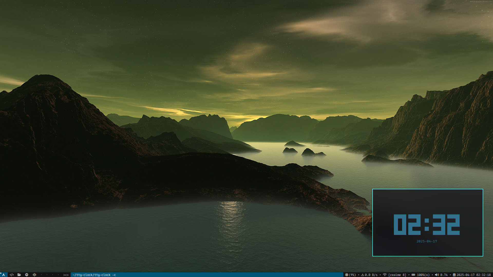

# Suckless  
A minimal and clean Suckless DWM setup that just sucks less.

## Screenshots



## Dependencies

Before installing, make sure the following packages are installed:

```bash
sudo pacman -S xorg-xinit base-devel git nvim feh
```

## Installation

1. **Clone the repository:**

```bash
git clone https://github.com/Pritamdhiman/Suckless.git
cd Suckless
```

2. **Install each component:**

Navigate into each directory (`dwm`, `dmenu`, `st`, `slstatus`) and run:

```bash
sudo make clean install
```

3. **Set up `.xinitrc`:**

Create or edit `~/.xinitrc` with the following:

```bash
#!/bin/sh

export PATH="$HOME/.local/bin:$PATH"
wal -n -i "/path_to_your_wallpaper" &
[ -f ~/.Xresources ] && xrdb ~/.Xresources
feh --bg-scale /path_to_your_wallpaper &
slstatus &
exec dwm
```

> Replace `/path_to_your_wallpaper` with the actual path to your preferred wallpaper.

Make it executable:

```bash
chmod +x ~/.xinitrc
```

4. **Create a desktop entry (optional for login managers):**

Create a file at `/usr/share/xsessions/dwm.desktop`:

```ini
[Desktop Entry]
Name=DWM
Comment=Dynamic Window Manager
Exec=/etc/X11/xinit/xinitrc
Type=XSession
```

5. **Auto-start DWM from TTY (optional):**

To automatically start DWM when logging in from a TTY, add this to your `~/.zprofile`:

```bash
# Source zsh config
if [ -f "$HOME/.zshrc" ]; then
    source "$HOME/.zshrc"
fi

# Startx
if [ -z "$DISPLAY" ] && [ "$XDG_VTNR" = 1 ]; then
  exec startx
fi
```

## Usage

You can start DWM in two ways:

- **From a display manager** (e.g., GDM, LightDM):  
  Log out and choose **DWM** from the session menu.

- **From a TTY:**  
  Log in and run:

  ```bash
  startx
  ```

---

Enjoy your minimal DWM setup! 🎨  
Feel free to customize it to fit your workflow.
