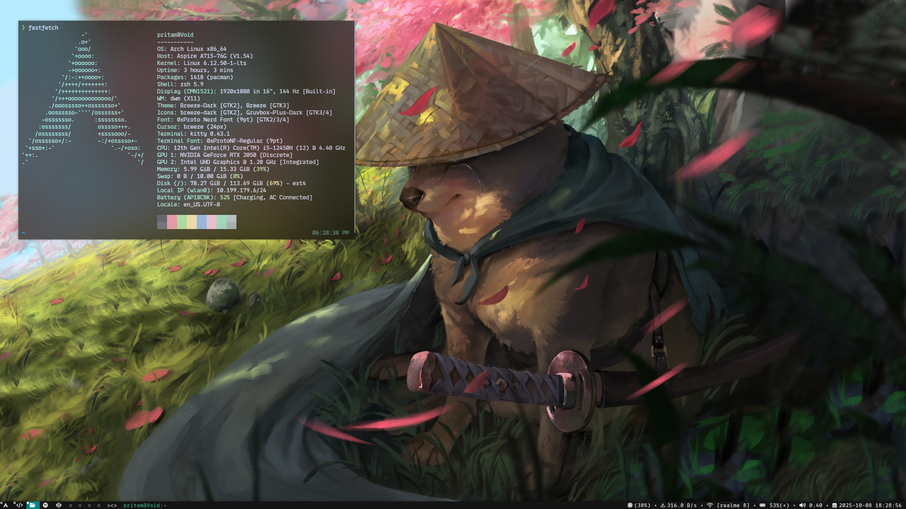

# Suckless  
A minimal and clean Suckless DWM setup that just sucks less.

## Screenshots



## Dependencies

Before installing, make sure the following packages are installed:

```bash
sudo pacman -S xorg-xinit base-devel git nvim feh picom flameshot brightnessctl
```

## Installation

1. **Clone the repository:**

```bash
git clone https://github.com/prtmxio/Suckless.git
cd Suckless
```

2. **Install each component:**

Navigate into each directory (`dwm`, `dmenu`, `st`, `slstatus`) and run:

```bash
sudo make clean install
```

3. **Set up `.xinitrc`:**

Create or edit `~/.xinitrc` with the following:

```bash
#!/bin/sh

export PATH="$HOME/.local/bin:$PATH"
wal -n -i "/path_to_your_wallpaper" &
[ -f ~/.Xresources ] && xrdb ~/.Xresources
feh --bg-scale /path_to_your_wallpaper &
slstatus &
exec dwm
```

> Replace `/path_to_your_wallpaper` with the actual path to your preferred wallpaper.

Make it executable:

```bash
chmod +x ~/.xinitrc
```

4. **Create a desktop entry (optional for login managers):**

Create a file at `/usr/share/xsessions/dwm.desktop`:

```ini
[Desktop Entry]
Name=DWM
Comment=Dynamic Window Manager
Exec=/etc/X11/xinit/xinitrc
Type=XSession
```

5. **Auto-start DWM from TTY (optional):**

To automatically start DWM when logging in from a TTY, add this to your `~/.zprofile`:

```bash
# Source zsh config
if [ -f "$HOME/.zshrc" ]; then
    source "$HOME/.zshrc"
fi

# Startx
if [ -z "$DISPLAY" ] && [ "$XDG_VTNR" = 1 ]; then
  exec startx
fi
```
# dwm Keybind Cheat Sheet

> `Mod` = **Alt** (Mod1Mask) | New windows attach **below** active window

---

## Layouts

| Keybind | Action |
|---|---|
| `Mod + r` | Dwindle (default) |
| `Mod + t` | Tile |
| `Mod + f` | Float |
| `Mod + m` | Monocle |
| `Mod + Shift + r` | Spiral |
| `Mod + Space` | Toggle last layout |
| `Mod + Shift + Space` | Toggle floating |

---

## Windows

| Keybind | Action |
|---|---|
| `Mod + j / k` | Focus next / prev window |
| `Mod + h / l` | Shrink / grow master area |
| `Mod + i / d` | Increase / decrease master count |
| `Mod + \` | Zoom (swap focused to master) |
| `Mod + q` | Kill focused window |
| `Mod + Tab` | Toggle last tag view |

---

## Launch

| Keybind | Action |
|---|---|
| `Mod + Return` | Terminal (kitty) |
| `Mod + p` | dmenu |
| `Mod + n` | Nautilus |

---

## Screenshot

| Keybind | Action |
|---|---|
| `Print` | Full screen → `~/Pictures/Screenshots` |
| `Shift + Print` | Interactive selection (flameshot gui) |

---

## Media Keys

| Keybind | Action |
|---|---|
| `Volume Up` | +5% volume |
| `Volume Down` | -5% volume |
| `Mute` | Toggle mute |
| `Brightness Up` | +5% brightness |
| `Brightness Down` | -5% brightness |

---

## Tags (Workspaces)

| Keybind | Action |
|---|---|
| `Mod + 1–9` | Switch to tag |
| `Mod + Ctrl + 1–9` | Toggle tag view |
| `Mod + Shift + 1–9` | Move window to tag |
| `Mod + Ctrl + Shift + 1–9` | Toggle window on tag |
| `Mod + 0` | View all tags |
| `Mod + Shift + 0` | Send window to all tags |

---

## Bar & System

| Keybind | Action |
|---|---|
| `Mod + b` | Toggle bar |
| `Mod + , / .` | Focus prev / next monitor |
| `Mod + Shift + , / .` | Move window to prev / next monitor |
| `Mod + Shift + q` | Quit dwm |

---

## Mouse (on windows)

| Action | Function |
|---|---|
| `Mod + Left click drag` | Move window |
| `Mod + Right click drag` | Resize window |
| `Mod + Middle click` | Toggle floating |

---

## Tags Layout

```
 1   2   3   4   5  ▫6  ▫7  ▫8  ▫9
```
Tags 1–5 use nerd font icons, 6–9 use `▫` dots.

## Usage

You can start DWM in two ways:

- **From a display manager** (e.g., GDM, LightDM):  
  Log out and choose **DWM** from the session menu.

- **From a TTY:**  
  Log in and run:

  ```bash
  startx
  ```

---

Enjoy your minimal DWM setup! 🎨  
Feel free to customize it to fit your workflow.
